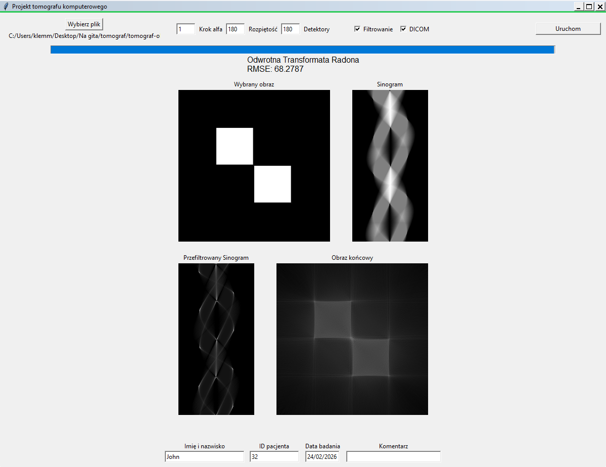

# Computer Tomography (CT) Simulator

This repository contains a Python-based graphical application that simulates the process of 2D image reconstruction used in Computed Tomography (CT) scanners. The tool takes a 2D image as input, generates a sinogram using the Radon transform, applies optional Ram-Lak filtering, and reconstructs the image using the Inverse Radon transform. It also supports reading and writing standard DICOM medical image files.

[Image of Radon Transform and Filtered Backprojection diagram]

---

## Features

* **Image Input Validation:** Load standard image formats (JPG, PNG) or medical DICOM files (`.dcm`).
* **Sinogram Generation:** Simulates X-ray projections using a configurable number of detectors, emitter span, and angular step.
* **Image Reconstruction:** Rebuilds the original image from the sinogram using backprojection.
* **Filtering:** Implements a Ram-Lak (Ramp) filter to reduce the blurring effect inherent to standard backprojection.
* **Error Measurement:** Calculates the Root Mean Square Error (RMSE) between the original and reconstructed images.
* **DICOM Integration:** Extracts metadata from input DICOM files and allows exporting the reconstructed image as a fully compliant DICOM file with customizable patient metadata.

---

## Algorithms and Mathematical Foundation

The core of the simulation relies on a combination of geometric line-drawing algorithms and signal processing techniques to perform the forward and inverse Radon transforms.

### 1. Radon Transform (Forward Projection)
The Radon transform simulates the process of capturing X-ray attenuation. For a given 2D image $f(x,y)$, it computes the line integrals along parallel paths. 

In this application, it is implemented discretely. Instead of continuous ray-tracing calculations, the **Bresenham's Line Algorithm** is utilized to determine the exact discrete pixels intersected by the X-ray beam. The algorithm calculates the average pixel intensity along the path from the emitter to each detector.

### 2. Ram-Lak (Ramp) Filter
Standard backprojection results in a significant blurring artifact due to the oversampling of low frequencies at the center of the frequency domain. To mitigate this, a high-pass Ram-Lak filter is applied to the sinogram before reconstruction. 

The discrete filter kernel $H(i)$ is constructed in the code as follows:

$$H(i) = \begin{cases} 1, & i = 0 \\ 0, & i \text{ is even} \\ \frac{-4}{\pi^2 i^2}, & i \text{ is odd} \end{cases}$$

The filter is applied via 1D convolution (`numpy.convolve`) across each row of the sinogram matrix.

### 3. Inverse Radon Transform (Filtered Backprojection)
The reconstruction process takes the filtered sinogram and distributes the attenuation values back across the 2D spatial grid. It utilizes an **Inverse Bresenham Algorithm** to precisely determine the $(x, y)$ coordinate pairs that form the path between the emitter and detector for a given projection angle, accumulating the sinogram values into those specific pixels.

### 4. Error Evaluation (RMSE)
To evaluate the mathematical fidelity of the reconstructed image against the original input, the Root Mean Square Error is computed:

$$RMSE = \sqrt{\frac{1}{N} \sum_{j=1}^{N} (I_{orig, j} - I_{recon, j})^2}$$

---

## Core Functions Reference

| Function | Description | Technical Details |
| :--- | :--- | :--- |
| `rescale(img)` | Normalizes image arrays. | Linearly interpolates matrix values to the $[0, 255]$ range to ensure consistent 8-bit grayscale processing. |
| `loadImage(path)` | Handles input file I/O. | Uses `skimage.io` to read files as grayscale arrays, followed immediately by array rescaling. |
| `brasenhamAlgorithm(img, x1, y1, x2, y2)` | Forward projection pathfinding. | Calculates the discrete pixel path between $(x_1, y_1)$ and $(x_2, y_2)$ and returns the average pixel intensity along this line. |
| `inverseBresenhamAlgorithm(...)` | Backprojection pathfinding. | Functionally similar to the forward algorithm, but returns a list of coordinate tuples $(x,y)$ instead of intensity values. |
| `radonTransform(...)` | Generates the sinogram. | Iterates through `numOfScans` (angles) and `numOfDetectors`. Calculates emitter/detector positions on a circumscribed circle and uses the Bresenham algorithm to populate the matrix. |
| `filtr(sinogram, img_label)` | Applies the Ram-Lak filter. | Constructs a 21-element discrete kernel and performs 1D convolution on each sinogram row. Truncates negative artifact values to $0$. |
| `inverseRadonTransform(...)` | Reconstructs the 2D image. | Iterates through angles and detectors, uses the inverse Bresenham algorithm to map projection paths, and accumulates sinogram intensities into a blank 2D matrix. |
| `RMSE(img1, img2)` | Calculates reconstruction error. | Utilizes element-wise matrix subtraction and squaring to return a tuple containing both `(MSE, RMSE)`. |
| `convertToDCM(...)` | Exports to DICOM format. | Leverages `pydicom` to construct a compliant `.dcm` file, generating mandatory UIDs and embedding user-provided metadata (Patient Name, ID, Study Date, Comments). |

---

